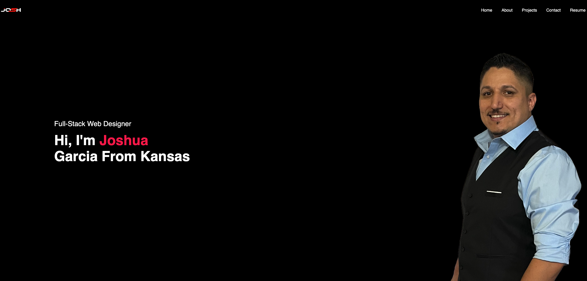
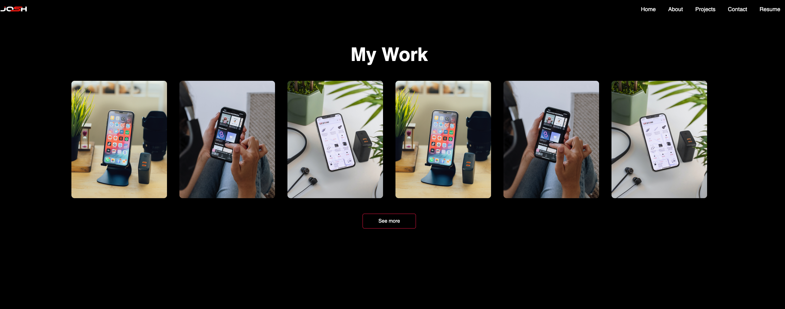
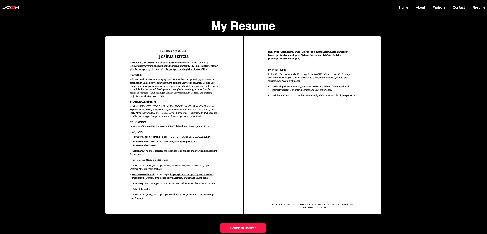

# REACT Portfolio
<!-- Added license badge below -->
 

## Description

This project is a REACT Portfolio project that utilizes vite. This is a front end app that is also a responsive design.

## Table of Contents

- [Link](#link)
- [ScreenShot](#screenshot)
- [Installation](#installation)
- [Usage](#usage)
- [Credits](#credits)
- [License](#license)
- [Badges](#badges)
- [API](#api)

## Link

Below are links to the deployed app and the repo: 
[React_Portfolio]() 
[Projects_Repo](https://github.com/garciajv86/React_Portfolio)

## ScreenShot
Website Screenshots:
 

## Installation

No installation needed!

## Usage

Simply visit the my Portfolio and click on the tab you wish to view and view that page, when you get to the projects, contact and resume page you will be able to interact with the page. In the projects page you can hover over the projects and see the projects name and description, to full the project just click and you will be directed to my project. In the contact page you will be able to fill out a form with a brief message you would like to send to me, or you can click on one of the icons and visit which ever social media platform you would like to contact me on!

## Credits

- Joshua V. Garcia

- [My GitHub Profile](https://github.com/garciajv86)

## License

 
This project is protected under the [MIT](https://choosealicense.com/licenses/mit/) License.

## Badges

 
 

 
 
 

 

## API

Vite and react-router-dom along with everything that comes pre-packaged with Vite.

- [REACT Docs](https://react.dev/reference/react)
- [REACT Router Docs](https://reactrouter.com/en/main)
- [Vite Docs](https://vitejs.dev/guide/)
- [NPM Docs](https://docs.npmjs.com/)
